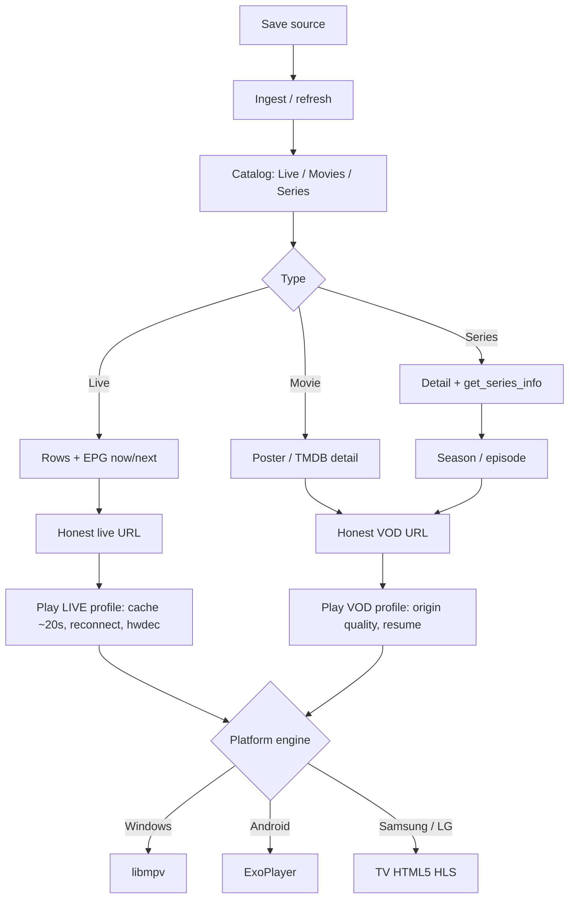

# PLAN-MAESTRO — Lux IPTV (Windows complete first)

Lux is a quality IPTV product. First ship is the **complete Windows app**, not a Chromium prototype. Android, Samsung, and LG come after, each with its own decoder.

Owner freeze **2026-08-30**: **9 screens, 12 flows, 7 Windows phases (F1–F7) + 3 platforms (F8–F10) + 4 backlog (F11–F14)**.

Reconciliation **2026-09-14**: **9 remaining Windows checklist items** (see `CHECKLIST.md`). FA-17/FA-18 have code on `242a36e`; they stay PARCIAL until Windows proves them.

This freeze **supersedes** 2026-08-28 (hls.js as product player, F3 before F4, D-6, pending D-3).

## Names (one product)

There is **one application: Lux**. “MVP” is not a second app. Do not use MVP in new work.

| Name | What it is |
| --- | --- |
| **Lux** | The product. One Electron app on Windows. |
| **Lux Desktop** | First complete ship (Windows F1–F7). This is what old docs called “MVP”. |
| **F2 / `lux-iptv-player-mpv`** | This SDD: libmpv engine **inside** Lux (not a separate player product). |
| **mpv** | Decoder process. The user still sees Lux. |
| **`lux-iptv-mvp`** | Historical OpenSpec folder (ingest/UI slice). Archive naming only. |
| **`lux-iptv-player`** | Orphan Chromium-player change. Do not collide with F2’s `lux-iptv-player-mpv`. |

## Quick path

1. One saved list (Xtream or M3U) with **Live / Movies / Series**.
2. Refresh → browse with rich info → open → **play**.
3. Windows play = **libmpv**. Done means all origin formats, max quality, continuous picture, real audio/subs, exclusive fullscreen.

## Vision

Netflix-like navigation (posters, fanart, synopsis, ratings) plus a player that behaves like a real IPTV client (TiviMate / Nightmare TV class), not a browser tab.

A list is done only when the whole flow works: refresh → browse → open → play. Live also needs EPG.

## Architecture

Shared across platforms: vault, ingest, catalog, **honest URL builder**, series `get_series_info`, resume rules, EPG data, TMDB.

Decoders are **not** shared:

| Ship | UI | Player |
| --- | --- | --- |
| Windows (F1–F7) | Electron UI | **in-process libmpv** (same process as Lux; child HWND of the BrowserWindow; FFmpeg inside; `hwdec=auto-safe`; live cache ~20s; never `cache=no`). Chromium GPU off unless `LUX_HW_ACCEL=true`. Not spawned `mpv.exe`, not Chromium `--wid` to an external player, not “open with VLC”. |
| Android (F8) | Native | ExoPlayer / Media3 |
| Samsung (F9) | Tizen web | Platform HTML5 / HLS |
| LG (F10) | webOS | Platform HTML5 / HLS |

Electron cannot be packaged into a real Android or Smart TV player.

### BPM — list to play



**URL builder rule:** persist real `container_extension` and `direct_source`. Never rewrite mkv/HEVC to `.mp4`. Use panel `allowed_output_formats` only when the engine needs a remux. Chromium is not the happy path.

## What we have vs what we lack

| We have | We lack (blocks Windows done) |
| --- | --- |
| Xtream + M3U ingest, sql.js catalog, honest URLs | Windows click-test of OSD inset bands (FA-17) |
| In-process libmpv + HWND child + OSD inset 88/168 (`0204b9c`) | Windows proof live `.m3u8` does not curl-abort (FA-18) |
| Origin live URL + HLS reconnect (`242a36e`); OSD load `.srt`/`.ass` | Windows proof subtitle file path reaches libmpv (FA-03) |
| Vault host-only + refresh; TMDB key onboarding UI; enrichment host | Windows proof Movies/Series posters after saved key (PA-06) |
| Resume clock, next-episode, Continue Watching movies + episodes | Windows proof episode resume appears on Home (FA-09) |
| EPG now/next IPC + live cards + S9 now/next list | Windows proof of guide zap and Xtream titles (FA-11/FA-12) |
| Installer extraResources for libmpv + `.node` | Windows NSIS run with DLL present (FA-13) |

## Modules

| ID | Module | Phase |
| --- | --- | --- |
| M1 | Source & credential vault | F3 |
| M2 | Ingest & catalog | F1 exists / F3 refresh |
| M3 | Honest URL builder | F2 |
| M4 | List browse | F1 / F5 see-all |
| M5 | Detail | F1 / F4 art |
| M6 | Windows player libmpv + tracks + fullscreen + OSD | F2 |
| M7 | TMDB (required metadata) | F4 |
| M8 | Shell / refresh chrome | F3 |
| M9 | Resume / next / continue | F5 |
| M10 | EPG | F6 |
| M11 | Windows installer (mpv inside) | F7 |
| M12 | Android / Samsung / LG runtimes | F8–F10 |
| M13 | Profiles, parental, search, license | F11–F14 backlog |

## Screens

9 — S1 Home, S2 Source vault, S3 Live, S4 Movies, S5 Series, S6 Detail, S7 Player, S8 See-all, S9 EPG. See `PANTALLAS-POR-FLUJO.md`.

S6 route in code: `/content/:type/:id` (type is required; sqlite ids are per-table).

## Dependencies

```
F1 browse (exists)
    → F2 Windows player (libmpv + URL + tracks + fullscreen + OSD)
    → F3 vault + refresh          (parallel after F1 OK)
    → F4 TMDB visual layer        (after F3 key/onboarding)
    → F5 VOD integrated flows     (after F2)
    → F6 EPG                      (after F2)
    → F7 Windows installer        (after F2)
F8 Android → F9 Samsung → F10 LG  (after Windows domain + URL builder)
F11–F14 backlog after F7
```

F2 does **not** wait for TMDB. Play does not depend on art. Quality bar for lists does.

## Phases we will develop — Windows (7)

| Phase | Name | Enables when done | Status |
| --- | --- | --- | --- |
| **F1** | Lists | Browse Live / Movies / Series, open detail, list episodes | Done |
| **F2** | Windows player | Honest URL; **in-process libmpv**; all origin formats; no freeze; audio/subs; load `.srt`; exclusive fullscreen; OSD usable | Engine + OSD inset + origin HLS + load-subtitle control in tree. Remaining: Windows proof of FA-17/FA-18/FA-03 |
| **F3** | Secure source | Refresh on Home/Live/Movies/Series; vault never shows secrets | Done |
| **F4** | TMDB layer | Posters, fanart, synopsis, rating on Home, rows, detail. Key is part of the product | Onboarding + worker start + row merge in tree. Remaining: Windows proof of posters (PA-06) |
| **F5** | VOD flows | See-all, Continue Watching, resume clock, next-episode | See-all/resume/next + episode Continue Watching in tree. Remaining: Windows proof |
| **F6** | EPG | Guide + now/next on Live, zap to S7 | Now/next list + `/epg` in tree. Remaining: Windows proof |
| **F7** | Windows package | Installer bundles libmpv. Chromium GPU **off** unless `LUX_HW_ACCEL=true` (D-14) | extraResources in tree. Remaining: Windows NSIS proof |

## Platforms after Windows (3)

| Phase | Enables |
| --- | --- |
| F8 Android | Same catalog/URL domain; ExoPlayer |
| F9 Samsung Tizen | HTML5/HLS of the TV |
| F10 LG webOS | HTML5/HLS of the TV |

## Backlog after F7 (4) — not this train

| Phase | Enables |
| --- | --- |
| F11 Profiles | Multi-profile |
| F12 Parental | PIN |
| F13 Search | Global search |
| F14 License | HWID / trial |

## Decisions

| Date | ID | Rule |
| --- | --- | --- |
| 2026-08-28 | D-1 | Real player on `/watch`. |
| 2026-08-28 | D-2 | Refresh in chrome; never display saved **username/password**. Configured vault may show **host only**. |
| 2026-08-28 | D-4 | Complete product; execute Windows F1–F7 before F11–F14. |
| 2026-08-28 | D-5 | Verify complete flows, not isolated units. |
| 2026-08-28 | D-7 | Metadata provider required. Current: TMDB. Degraded = runtime outage only. |
| 2026-08-28 | D-8 | EPG is core Live (F6), not optional. |
| 2026-08-30 | D-9 | Ship order: complete Windows → Android → Samsung → LG. Decoder is per platform. |
| 2026-08-30 | D-10 | Windows product engine is **libmpv**. Chromium/hls.js is not the happy path. **Supersedes D-6** (hls.js + MP4 + ABR as product player) and **closes D-3** (mpv no longer “only with HEVC evidence”). |
| 2026-08-30 | D-11 | Player chrome is in F2: real audio select, real subtitle select + load file, exclusive fullscreen covering the Windows taskbar, OSD tooltips and truthful icons. |
| 2026-08-30 | D-12 | URL builder is honest: real extension, `direct_source`, no fake `.mp4`. |
| 2026-08-30 | D-13 | One product: **Lux**. First ship: **Lux Desktop**. Engine SDD: **`lux-iptv-player-mpv`**. Stop saying MVP. |
| 2026-08-30 | D-14 | F2 target is **gold**: libmpv in-process (libmpv API in Lux). Reject as product: spawned `mpv.exe` child window, Chromium `--wid` to an external player, and external VLC/mpv. If Electron ABI blocks a Node addon, the fallback is still libmpv in-process (small native host / updated binding) — not a half player. |
| 2026-09-13 | D-14 clarified | Gold embed is a **child HWND of the Lux BrowserWindow**. Chromium GPU stays **off** on Windows unless `LUX_HW_ACCEL=true`. Decode is libmpv `hwdec`, not Chromium. |

## Open for owner

None blocking this freeze. F2 SDD is archived (`a9f014f`). Next product gate: Windows proof of FA-17/FA-18/FA-03, then F4 (FA-08 then PA-06), then FA-09, then F6, then F7.

## Consistency

| Axis | Value |
| --- | --- |
| Screens | 9 |
| Flows | 12 |
| Checklist remaining (Windows) | 9 |
| Windows develop | F1–F7 |
| Platforms | F8–F10 |
| Backlog | F11–F14 |
